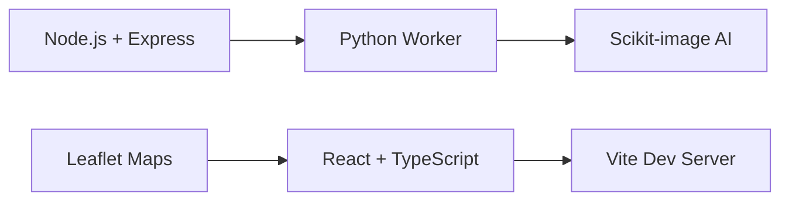

# 🌍 ReverbEx Atlas

<div align="center">


**Advanced AI-Powered Geospatial Image Alignment & Visualization Platform**

[](https://reactjs.org/)
[](https://www.typescriptlang.org/)
[](https://nodejs.org/)
[](https://www.python.org/)
[](LICENSE)

[Features](#-features) • [Quick Start](#-quick-start) • [Documentation](#-documentation) • [Demo](#-demo) • [Contributing](#-contributing)

</div>

---

## 🎯 What is ReverbEx Atlas?

ReverbEx Atlas is a **next-generation web platform** that leverages advanced AI algorithms to align satellite and geospatial imagery with **sub-pixel precision**. Perfect for environmental monitoring, urban planning, disaster response, and precision agriculture.

### ✨ Key Highlights

- 🤖 **AI-Powered Alignment** - Phase cross-correlation algorithms with 100x precision
- 🗺️ **Real-time Dual Maps** - Interactive synchronized visualization
- ⚡ **Professional Grade** - Handles multi-band satellite imagery and large datasets
- 🎨 **Modern UI** - Futuristic interface with built-in interactive tutorial
- 🚀 **One-Click Deploy** - Get started in under 2 minutes

---

## 🚀 Quick Start

### Prerequisites

- [Node.js 18+](https://nodejs.org/)
- [Python 3.9+](https://www.python.org/)

### Installation

**Windows:**
```bash
start.bat
```

**Mac/Linux:**
```bash
chmod +x start.sh
./start.sh
```

**Manual Setup:**
```bash
# Install dependencies
npm install
cd api && npm install
cd ../worker && pip install -r requirements.txt

# Launch platform
npm run dev  # Frontend at http://localhost:5173
# API runs at http://localhost:8080
```

### First Steps

1. Open http://localhost:5173
2. Click the **"Tutorial"** button (auto-shows for first-time users)
3. Upload two GeoTIFF files or use sample data
4. Draw an Area of Interest (AOI) on the map
5. Click **"Start AI Alignment"**
6. View your perfectly aligned images! ✨

---

## 🌟 Features

### 🎯 Core Capabilities

| Feature | Description |
|---------|-------------|
| **AI Image Alignment** | NASA-grade phase cross-correlation with sub-pixel accuracy |
| **Dual Map Sync** | Side-by-side comparison with perfect synchronization |
| **Interactive Drawing** | Draw Areas of Interest directly on  maps |
| **Real-time Processing** | Live progress updates and status tracking |
| **Multi-format Support** | GeoTIFF, NetCDF, and standard image formats |

### 🎨 User Experience

- **Interactive Tutorial** - Built-in guided tour (like Notion/Figma)
- **Dark Theme** - Futuristic design with cyan/purple gradients
- **Responsive** - Works on desktop, tablet, and mobile
- **Loading States** - Smooth animations and transitions
- **Error Handling** - User-friendly messages and recovery

### 🛠️ Technology Stack



- **Frontend:** React 19, TypeScript, Tailwind CSS
- **Backend:** Node.js, Express
- **Processing:** Python, scikit-image, NumPy
- **Maps:** Leaflet, GeoRaster
- **Build:** Vite

---

## 📊 Use Cases

### 🌍 Environmental Monitoring
- Track deforestation patterns
- Monitor wetland changes
- Analyze urban green spaces

### 🏗️ Urban Development
- City expansion tracking
- Infrastructure planning
- Construction progress monitoring

### 🚨 Disaster Response
- Natural disaster damage assessment
- Before/after satellite imagery comparison
- Recovery coordination

### 🌾 Precision Agriculture
- Crop health monitoring across seasons
- Field boundary analysis
- Irrigation pattern tracking

---

## 📖 Documentation

- **[Features Guide](FEATURES.md)** - Detailed feature explanations
- **[Testing Guide](TESTING_GUIDE.md)** - Comprehensive testing instructions
- **[Contributing](CONTRIBUTING.md)** - How to contribute to the project

### Architecture Overview

```
┌─────────────────┐    ┌─────────────────┐    ┌─────────────────┐
│   Frontend      │◄───┤   API Engine    │◄───┤   AI Processor  │
│   (React)       │    │   (Node.js)     │    │   (Python)      │
└─────────────────┘    └─────────────────┘    └─────────────────┘
         │                       │                       │
         ▼                       ▼                       ▼
┌─────────────────┐    ┌─────────────────┐    ┌─────────────────┐
│  Dual Maps +    │    │  Job Queue +    │    │  GeoTIFF        │
│  AI Controls    │    │  Real-time API  │    │  Processing     │
└─────────────────┘    └─────────────────┘    └─────────────────┘
```

---

## 🎮 Demo

### Screenshots

**Main Interface**
> Dark futuristic theme with synchronized dual maps

**Interactive Tutorial**
> Step-by-step guided tour for new users

**AI Processing**
> Real-time status updates and progress tracking

---

## 🤝 Contributing

We welcome contributions! Whether you're interested in:

- 🐛 **Bug fixes** and **✨ new features**
- 📚 **Documentation** improvements
- 🎨 **UI/UX** enhancements
- 🧪 **Testing** and **📊 performance**

See [CONTRIBUTING.md](CONTRIBUTING.md) for detailed guidelines.

### Development Setup

```bash
# Clone repository
git clone https://github.com/Razorrag/Reverbex_atlas.git
cd Reverbex_atlas

# Install dependencies
npm install
cd api && npm install
cd ../worker && pip install -r requirements.txt

# Run in development mode
npm run dev
```

---

## 📄 License

This project is licensed under the MIT License - see the [LICENSE](LICENSE) file for details.

---

## 🌟 Acknowledgments

- **Leaflet** - Interactive mapping library
- **Scikit-image** - Image processing algorithms
- **React Leaflet** - React components for Leaflet
- **GeoRaster** - Raster data visualization

---

## 📧 Contact

**Anurag Singh** - [@Razorrag](https://github.com/Razorrag)

**Project Link:** [https://github.com/Razorrag/Reverbex_atlas](https://github.com/Razorrag/Reverbex_atlas)

---

<div align="center">

**Built with ❤️ for the geospatial community**

⭐ **Star this repo if you find it useful!** ⭐

</div>